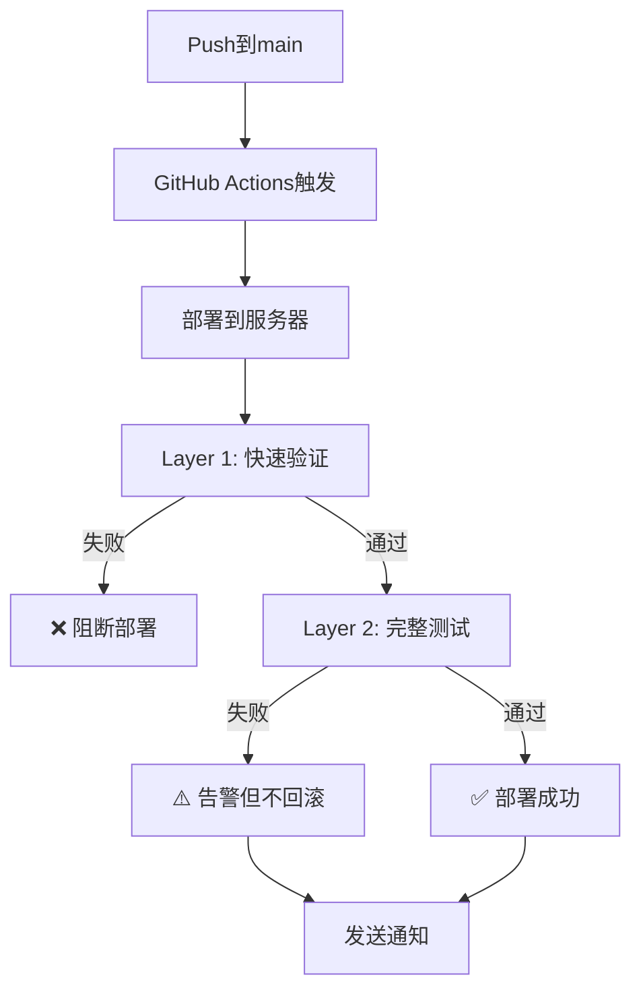

# K38-TIP 测试体系文档

> **融合版本**: Claude + 小五联合设计  
> **版本**: v1.1.5  
> **最后更新**: 2026-06-23

---

## 🎯 设计理念

### 三层测试架构

```
┌─────────────────────────────────────┐
│  Layer 1: 部署快速验证 (2-3分钟)      │  🚨 失败阻断部署
│  - 基于小五方案                       │
│  - 检查核心功能                       │
│  - API + 卡片 + 结构                 │
└─────────────────────────────────────┘
           ↓ 通过
┌─────────────────────────────────────┐
│  Layer 2: 部署后详细验证 (5-8分钟)    │  ⚠️ 失败告警不回滚
│  - 基于Claude方案                    │
│  - 元素位置 + 数据一致性              │
│  - 视觉回归 + 性能测试                │
└─────────────────────────────────────┘
           ↓ 通过
┌─────────────────────────────────────┐
│  Layer 3: 夜间全面测试 (10-15分钟)   │  📊 生成报告次日修复
│  - 多浏览器 + 多设备                  │
│  - 性能监控 + 压力测试                │
│  - 每晚2点自动执行                    │
└─────────────────────────────────────┘
```

---

## 🚀 快速开始

### 安装依赖

```bash
# 1. 安装Node依赖
npm install

# 2. 安装浏览器
npm run install-browsers
```

### 本地测试

```bash
# 快速验证（Layer 1）
npx playwright test tests/quick.spec.js

# 完整测试（Layer 2）
npx playwright test tests/visual-full.spec.js

# 所有测试
npm test

# 带UI界面
npm run test:ui

# 查看报告
npm run report
```

---

## 📋 测试检查项

### Layer 1: 部署快速验证 (小五方案)

| 检查项 | 说明 | 失败动作 |
|--------|------|---------|
| API健康检查 | /api/version 可访问 | 🚨 阻断 |
| API返回数据 | /api/candidates 有数据 | 🚨 阻断 |
| 页面可访问 | 首页正常加载 | 🚨 阻断 |
| 比赛卡片数量>0 | 至少显示1个卡片 | 🚨 阻断 |
| 卡片结构完整 | 复选框+球队名+胜率 | 🚨 阻断 |
| 预测标签存在 | .mc-rec 元素存在 | 🚨 阻断 |
| 控制台无严重错误 | 无404/500错误 | ⚠️ 警告 |
| 截图存档 | 桌面+移动端截图 | - |

**执行时间**: 2-3分钟  
**执行时机**: 每次部署后立即执行  
**失败策略**: 任何阻断项失败立即中断部署

### Layer 2: 完整视觉测试 (Claude方案)

| 检查项 | 说明 | 失败动作 |
|--------|------|---------|
| 搜索框位置 | Y坐标<300px | ⚠️ 告警 |
| 时间选择器 | 元素存在且可见 | ⚠️ 告警 |
| 卡片位置验证 | 100px < Y < 800px | ⚠️ 告警 |
| 卡片内容检查 | 队伍名+VS+胜率格式 | ⚠️ 告警 |
| 智能按钮位置 | Y > 页面高度50% | ⚠️ 告警 |
| API数据一致性 | 前端渲染≤API返回 | ⚠️ 告警 |
| 视觉回归对比 | 截图差异<500px | ⚠️ 告警 |
| 移动端响应式 | 375x667正常显示 | ⚠️ 告警 |
| 性能测试 | 加载时间<5秒 | ⚠️ 告警 |

**执行时间**: 5-8分钟  
**执行时机**: Layer 1通过后执行  
**失败策略**: 发送告警但不回滚部署

### Layer 3: 夜间全面测试

| 测试类型 | 覆盖范围 |
|---------|---------|
| 多浏览器 | Chrome, Firefox, Safari |
| 多设备 | 桌面, 移动端 |
| 性能监控 | Lighthouse CI |
| 压力测试 | 并发访问测试 |

**执行时间**: 10-15分钟  
**执行时机**: 每天凌晨2点  
**失败策略**: 自动创建Issue，次日修复

---

## 🔄 CI/CD 流程

### 部署流程图



### Workflow文件

- `.github/workflows/deploy-fusion.yml` - 主部署流程（融合版本）
- `.github/workflows/nightly-test.yml` - 夜间测试
- `.github/workflows/deploy.yml` - 原小五版本（保留）

---

## 📸 截图和报告

### 查看方式

1. **GitHub Actions页面**
   - 访问: `https://github.com/k38mail-star/k38-tip/actions`
   - 选择最新的workflow run
   - 点击 "Artifacts" 查看截图和报告

2. **本地查看**
   ```bash
   # 查看HTML报告
   npm run report

   # 截图位置
   ls test-results/
   ls playwright-report/
   ```

### 截图说明

| 文件名 | 说明 |
|--------|------|
| `deploy-success-desktop.png` | 部署成功桌面截图 |
| `deploy-success-mobile.png` | 部署成功移动截图 |
| `homepage-full.png` | 完整页面截图 |
| `homepage-mobile.png` | 移动端截图 |

---

## 🛠️ 常用命令

### 测试命令

```bash
# Layer 1 快速测试
npx playwright test tests/quick.spec.js

# Layer 2 完整测试
npx playwright test tests/visual-full.spec.js

# 只测试Chrome
npm run test:chrome

# 只测试移动端
npm run test:mobile

# 调试模式
npm run test:debug

# 更新视觉回归基准
npx playwright test --update-snapshots
```

### 部署命令

```bash
# 部署后验证
./post-deploy-check.sh

# 手动触发夜间测试
gh workflow run nightly-test.yml
```

---

## 🐛 问题排查

### Q1: Layer 1 测试失败怎么办？

**答**: Layer 1失败说明核心功能有问题，部署已被阻断。

1. 查看GitHub Actions日志
2. 下载失败截图
3. 修复问题后重新push
4. 确保本地测试通过再push

### Q2: Layer 2 测试失败但部署成功？

**答**: Layer 2是详细检查，失败不影响部署。

1. 查看告警信息
2. 判断是否需要立即修复
3. 不紧急的话可以次日处理
4. 修复后会在下次部署时验证

### Q3: 如何查看测试截图？

**答**: 
1. GitHub Actions → 最新run → Artifacts
2. 下载 `layer1-deploy-screenshots` 或 `layer2-screenshots`
3. 解压查看PNG文件

### Q4: 视觉回归测试一直失败？

**答**: 可能需要更新基准截图

```bash
# 更新基准
npx playwright test --update-snapshots

# 提交更新
git add test-results/
git commit -m "chore: 更新视觉回归基准截图"
git push
```

---

## 📊 方案对比

### 融合前 vs 融合后

| 维度 | 小五方案 | Claude方案 | 融合方案 |
|------|---------|-----------|---------|
| 部署速度 | ⚡ 2-3分钟 | 🐢 10-15分钟 | ⚡ 2-3分钟 (L1) |
| 测试覆盖 | 📊 基础4项 | 📊📊📊 详细10项 | 📊📊📊 分层14项 |
| 错误拦截 | ✅ 关键错误 | ✅✅✅ 所有问题 | ✅✅ 智能分级 |
| 部署信心 | 😐 中等 | 😊 高 | 😊😊 极高 |
| 失败处理 | 🚨 阻断 | ⚠️ 告警 | 🚨/⚠️ 智能 |
| 维护成本 | 💰 低 | 💰💰 中 | 💰💰 中 |

### 融合优势

✅ **保留小五方案的速度** - Layer 1快速验证  
✅ **增加Claude方案的全面性** - Layer 2详细检查  
✅ **智能失败策略** - 关键问题阻断，细节问题告警  
✅ **长期质量保证** - Layer 3夜间监控  
✅ **可扩展性** - 易于添加新的测试项  

---

## 🎓 最佳实践

### 开发流程

1. **本地开发**
   ```bash
   # 修改代码
   # 运行快速测试
   npx playwright test tests/quick.spec.js
   ```

2. **提交前**
   ```bash
   # 确保测试通过
   npm test
   git add .
   git commit -m "fix: 修复XXX"
   ```

3. **Push后**
   - 观察GitHub Actions
   - Layer 1失败 → 立即修复
   - Layer 2失败 → 评估优先级

4. **部署成功后**
   - 查看截图确认UI正常
   - 查看告警决定是否需要hotfix

### 添加新测试

1. **Layer 1 快速测试** (`tests/quick.spec.js`)
   - 只添加核心功能检查
   - 失败必须阻断部署
   - 执行时间<30秒

2. **Layer 2 完整测试** (`tests/visual-full.spec.js`)
   - 添加详细UI/交互检查
   - 失败发送告警
   - 执行时间<5分钟

3. **Layer 3 夜间测试**
   - 添加到现有spec文件
   - 或创建新的专项测试

---

## 🏆 成功案例

### Bug修复流程

**场景**: 比赛卡片不显示bug

1. **问题发现**: 用户报告页面空白
2. **本地复现**: 运行测试发现 `ml.appendChild(row)` 缺失
3. **快速修复**: 添加缺失代码
4. **测试验证**: Layer 1通过
5. **推送部署**: 自动部署+验证
6. **确认修复**: 查看截图确认卡片显示

**时间**: 从发现到修复上线 < 10分钟

---

## 📞 支持

**遇到问题？**
- 查看本文档FAQ
- 查看GitHub Actions日志
- 联系: k38mail@gmail.com
- 提交Issue: [GitHub Issues](https://github.com/k38mail-star/k38-tip/issues)

---

## 🔖 附录

### 文件清单

```
k38-tip/
├── .github/workflows/
│   ├── deploy-fusion.yml      # 主部署流程（融合版本）
│   ├── nightly-test.yml        # 夜间测试
│   └── deploy.yml              # 原小五版本
├── tests/
│   ├── quick.spec.js           # Layer 1 快速测试
│   └── visual-full.spec.js     # Layer 2 完整测试
├── reports/
│   ├── test-fusion-analysis.md # 方案融合分析
│   └── visual_testing_plan.md  # 小五原始方案
├── playwright.config.js        # Playwright配置
├── package.json                # 依赖管理
├── post-deploy-check.sh        # 部署后脚本
└── TESTING.md                  # 本文档
```

### 版本历史

- **v1.1.5** (2026-06-23) - 融合Claude和小五的测试方案
- **v1.1.4** - 小五添加视觉测试
- **v1.1.3** - Claude修复卡片显示bug

---

**维护者**: Claude Code + 小五  
**审核者**: K38 Team  
**下次审查**: 2026-07-01
